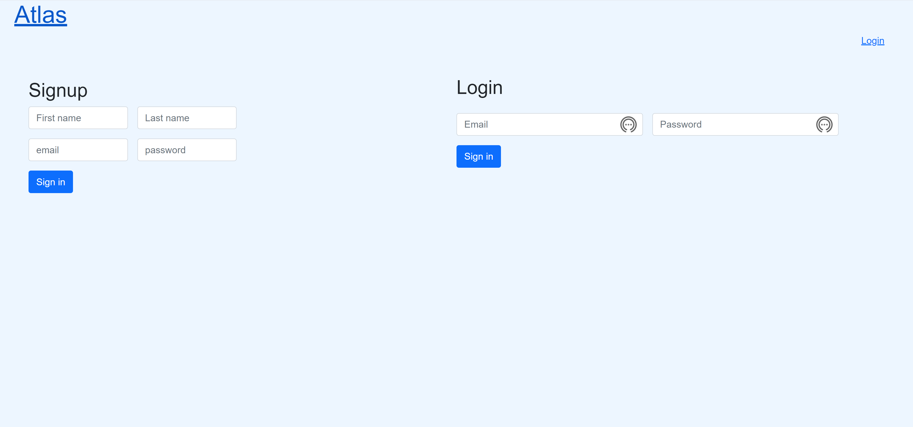

# Job-Tracker

Our 2nd project

## Description

There are so many websites out there to apply for jobs, it can be very hard to keep track of where you applied and off which sites. Our site makes your job hunting that much easier. Atlas allows the user to store the information for their job hunt all in one place as well as create reviews based on their experience of the application/hiring process.

[Link for Deployed App](https://atlas-job-tracker.herokuapp.com/)

## Installation

To install this project you must first have Node.js. After you can download all our packages by typing the command 'npm install' into your terminal.

## Usage

To get started the user must login into their account if one is already created or if they are a new user they can create an account. Upon creating a new account you will receive a welcome email from Atlas. Once you login/sign up the user will be redirected to their profile page where they can create a job appplication card with by filling in all the fields of the form like the url for where the applied for the job, the name of the role, salary, company name, where it's located, the status of your job application, whether you are interviewing, are be onboarded or, have been rejected. You can also create reviews on your homepage by filling out the form based on your experience through the application process or your experience as an employee there.

## Credits

[Carlos Hernandez](https://github.com/confusion-matrix), [Christian Castillo](https://github.com/chriscast94), [Kelly Cano](https://github.com/Krcano)

## Technologies
Javascript, MySQL, CSS, Bootstrap, Handlebars, Nodemailer, Node.js, Heroku

## License

[License: MIT](https://opensource.org/licenses/MIT)
MIT License

Copyright (c) [2021] []

Permission is hereby granted, free of charge, to any person obtaining a copy
of this software and associated documentation files (the "Software"), to deal
in the Software without restriction, including without limitation the rights
to use, copy, modify, merge, publish, distribute, sublicense, and/or sell
copies of the Software, and to permit persons to whom the Software is
furnished to do so, subject to the following conditions:

The above copyright notice and this permission notice shall be included in all
copies or substantial portions of the Software.

THE SOFTWARE IS PROVIDED "AS IS", WITHOUT WARRANTY OF ANY KIND, EXPRESS OR
IMPLIED, INCLUDING BUT NOT LIMITED TO THE WARRANTIES OF MERCHANTABILITY,
FITNESS FOR A PARTICULAR PURPOSE AND NONINFRINGEMENT. IN NO EVENT SHALL THE
AUTHORS OR COPYRIGHT HOLDERS BE LIABLE FOR ANY CLAIM, DAMAGES OR OTHER
LIABILITY, WHETHER IN AN ACTION OF CONTRACT, TORT OR OTHERWISE, ARISING FROM,
OUT OF OR IN CONNECTION WITH THE SOFTWARE OR THE USE OR OTHER DEALINGS IN THE
SOFTWARE.
